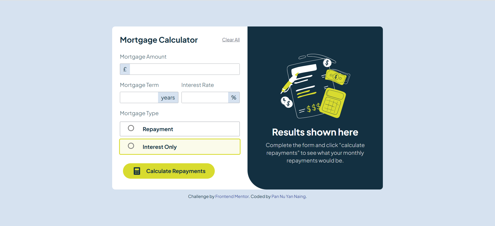
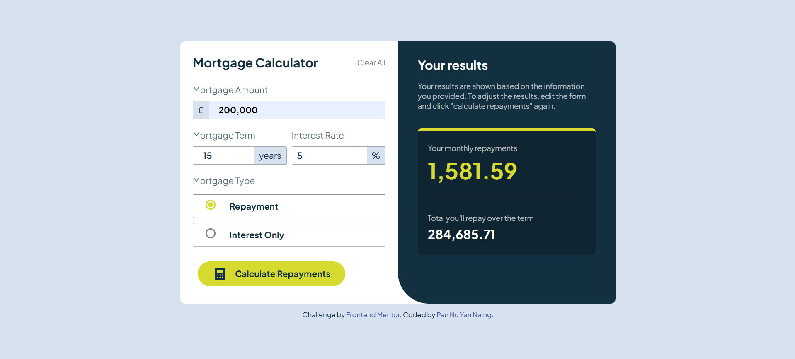
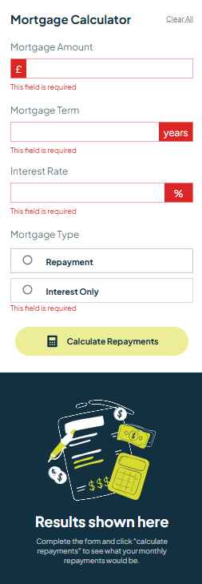

# Frontend Mentor - Mortgage repayment calculator solution

This is a solution to the [Mortgage repayment calculator challenge on Frontend Mentor](https://www.frontendmentor.io/challenges/mortgage-repayment-calculator-Galx1LXK73). Frontend Mentor challenges help you improve your coding skills by building realistic projects. 

## Table of contents

- [Overview](#overview)
  - [The challenge](#the-challenge)
  - [Screenshot](#screenshot)
  - [Links](#links)
- [My process](#my-process)
  - [Built with](#built-with)
  - [What I learned](#what-i-learned)
- [Author](#author)

## Overview

### The challenge

Users should be able to:

- Input mortgage information and see monthly repayment and total repayment amounts after submitting the form
- See form validation messages if any field is incomplete
- Complete the form only using their keyboard
- View the optimal layout for the interface depending on their device's screen size
- See hover and focus states for all interactive elements on the page

### Screenshot





### Links

- Solution URL: https://www.frontendmentor.io/solutions/mortgage-repayment-calculator-using-tailwind-css-a7hc7IPio6
- Live Site URL: https://pannuyn.github.io/Mortgage-Payment-Calculator/

## My process

### Built with

- Semantic HTML5 markup
- CSS custom properties
- Flexbox
- TailwindCss
- JavaScript

### What I learned

- how to add comma automatically for specific fields
- how to limit user input
- how to make yellow colored radio button (native color changing alone is not okay for yellow color)
- how to make radio button checked when clicked on container for better usability
- how to solve span disappearing in small screens

To see how you can add code snippets, see below:

```html
<h1>Some HTML code I'm proud of</h1>
```
```css
/* For yellow colored radio, customized styling is needed
since accent-color alone won't work as expected on yellow unlike other colors */
.yellow-radio {
    appearance: none;  
    border: 2px solid gray; /* border color before checking */
    width: 16px;
    height: 16px;
    border-radius: 50%;
    padding: 2px;
}
.yellow-radio:checked {
    background-color: #D8DB2F; /* border color after checking */
    box-shadow: inset 0 0 0 2px white; /* white ring inside */
    border: 2px solid #D8DB2F; /* filled circle inside */
}  
```

## Author

- Frontend Mentor - [@PannuYN](https://www.frontendmentor.io/profile/PannuYN)